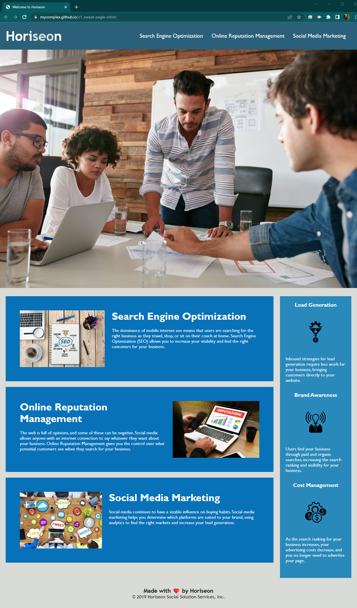

# Horiseon Website Rework

## Table of Contents

- [Scope of Work](#scope-of-work)
- [Live Website](#live-website)
- [Before and After Screenshots](#before-and-after-screenshots)
- [Copyright](#copyright)

## Scope of Work

Horiseon Social Solution Services, Inc. is a modest SEO, Online Reputation Management, and Social Media Marketing firm with big dreams. I've been contracted to review their existing website codebase for opportunities to improve accessibility and perform a bit of code maintenance. As a result of the work performed, Horiseon should also expect a boost in search rankings.

## Live Website

Browse to https://mycomplex.github.io/c1_sweet-eagle-orbit/ to review the improvements.

## Before and After Screenshots

<figure>
    
    <figcaption>Before Improvements</figcaption>
</figure>
 

<figure>
    
    <figcaption>After Improvements</figcaption>
</figure>

## Copyright

© 2023 Horiseon Social Solution Services, Inc.